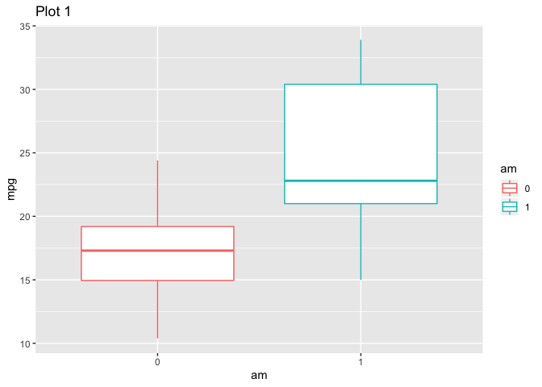
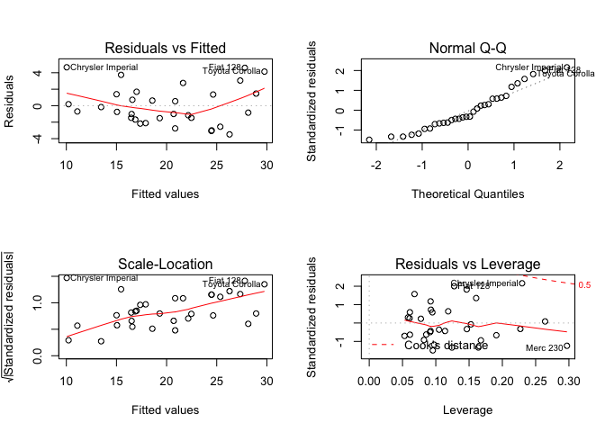

## Synopsis

This is a course project for Coursera's course "Regression models". In this project
I will look at the set of cars and explore the relationship between a set of variables
and miles per gallon (MPG). The questions of interest for this project is:

1. Is an automatic or manual transmission better for MPG?
2. What is the MPG difference between automatic and manual transmissions?

According to the data, cars with manual transmission gives plus 2.9 miles per
gallon in comaprison with cars with automatic transmission if we hold other parameters
constant. However, the data set is pretty small and if we remove outliners, the
advantage becomes much less and not statistically important. So, to make more
convincing inferences it is necessary to explore larger data sets.

## Exploratory data analyses and model fitting

Our data is:

```r
library(datasets); data("mtcars")
head(mtcars,2)
```

```
##               mpg cyl disp  hp drat    wt  qsec vs am gear carb
## Mazda RX4      21   6  160 110  3.9 2.620 16.46  0  1    4    4
## Mazda RX4 Wag  21   6  160 110  3.9 2.875 17.02  0  1    4    4
```
The outcome we are interested in is mpg and the predictor is am (0 = automatic, 1 = manual). I want to store am as a factor variable.

```r
mtcars$am = factor(mtcars$am)
```
Now, let's make a boxplot to see if where is a difference between automatic and
manual tranmission - it's in the appendix (Plot 1). Manual transmission seems to be much
better! What does a simple model tell us?

```r
fitAm = lm(mpg ~ am, data = mtcars)
summary(fitAm)$coef
```

```
##              Estimate Std. Error   t value     Pr(>|t|)
## (Intercept) 17.147368   1.124603 15.247492 1.133983e-15
## am1          7.244939   1.764422  4.106127 2.850207e-04
```
It's very-very impressive: manual transmission gives plus 7.2 miles. But we have
to consider other variables, of course. Let's look just on the am coefficient in this case.

```r
fitAll = lm(mpg ~ ., data = mtcars)
summary(fitAll)$coef["am1",]
```

```
##   Estimate Std. Error    t value   Pr(>|t|) 
##  2.5202269  2.0566506  1.2254035  0.2339897
```
The same sign of the coefficient, but not so impressive and p-value is very large,
23%, so the coefficient is not statistically significant.

Let's find the perfect fit. We don't need so much variables in the model. So, I will try to find a variable which is highly correlated with the others, fit a model without this variable and compare the model fitAll with this new model to see if it's okey to get rid of the variable. 


```
## Loading required package: carData
```

```r
round(vif(fitAll),2)
```

```
##   cyl  disp    hp  drat    wt  qsec    vs    am  gear  carb 
## 15.37 21.62  9.83  3.37 15.16  7.53  4.97  4.65  5.36  7.91
```
So, for the disp, the variance inflation factor is the biggest. Let's try without disp.

```r
fitD = lm(mpg ~ . - disp, data = mtcars)
anova(fitAm, fitD, fitAll)
```

```
## Analysis of Variance Table
## 
## Model 1: mpg ~ am
## Model 2: mpg ~ (cyl + disp + hp + drat + wt + qsec + vs + am + gear + 
##     carb) - disp
## Model 3: mpg ~ cyl + disp + hp + drat + wt + qsec + vs + am + gear + carb
##   Res.Df    RSS Df Sum of Sq       F    Pr(>F)    
## 1     30 720.90                                   
## 2     22 151.41  8    569.49 10.1353 1.068e-05 ***
## 3     21 147.49  1      3.92  0.5576    0.4635    
## ---
## Signif. codes:  0 '***' 0.001 '**' 0.01 '*' 0.05 '.' 0.1 ' ' 1
```
The residual variation is much less for fitD than for fitAm, F-statistic is large, i.e. significant. So, the fitD is much better than fitAm. But if we compare fitD, fitAll -
there is no difference, F-statistic is small, we can get rid of disp - and our model
wouldn't be worse.

I repeat this step several times, with different variables. I remove cyl, hp, gear,
vs, drat, carb and leave only am, wt, qsec - they can be significant. Let's check it.


```r
fitAmWt = lm(mpg ~ am + wt, data = mtcars)
fitAmWtQ = lm(mpg ~ am + wt + qsec, data = mtcars)
anova(fitAm, fitAmWt, fitAmWtQ, fitAll)
```

```
## Analysis of Variance Table
## 
## Model 1: mpg ~ am
## Model 2: mpg ~ am + wt
## Model 3: mpg ~ am + wt + qsec
## Model 4: mpg ~ cyl + disp + hp + drat + wt + qsec + vs + am + gear + carb
##   Res.Df    RSS Df Sum of Sq       F    Pr(>F)    
## 1     30 720.90                                   
## 2     29 278.32  1    442.58 63.0133 9.325e-08 ***
## 3     28 169.29  1    109.03 15.5240 0.0007497 ***
## 4     21 147.49  7     21.79  0.4432 0.8636073    
## ---
## Signif. codes:  0 '***' 0.001 '**' 0.01 '*' 0.05 '.' 0.1 ' ' 1
```
So, am, wt, qsec are all necessary and I choose fitAmWtQ as my model.

```r
round(summary(fitAmWtQ)$coef,3)
```

```
##             Estimate Std. Error t value Pr(>|t|)
## (Intercept)    9.618      6.960   1.382    0.178
## am1            2.936      1.411   2.081    0.047
## wt            -3.917      0.711  -5.507    0.000
## qsec           1.226      0.289   4.247    0.000
```
Am coefficient is 2.9 and it's significant. This mean that manual transmition gives
2.9 miles more per gallon holding wt and qsec constant.

## Outliners
First of all, look at the residul plot in the annendix. And points with largest Cook's distance:

```r
cd = round(cooks.distance(fitAmWtQ),2)
cd[order(cd, decreasing =T)[1:4]]
```

```
## Chrysler Imperial          Merc 230          Fiat 128    Toyota Corolla 
##              0.35              0.16              0.15              0.14
```
So, my outliners is: Merc 230, Chrysler Imperial, Fiat 128, Toyota Corolla. Others is less than 0.1.

```r
outliners = c("Merc 230", "Chrysler Imperial", "Fiat 128", "Toyota Corolla")
mtcars[(row.names(mtcars) %in% outliners),]
```

```
##                    mpg cyl  disp  hp drat    wt  qsec vs am gear carb
## Merc 230          22.8   4 140.8  95 3.92 3.150 22.90  1  0    4    2
## Chrysler Imperial 14.7   8 440.0 230 3.23 5.345 17.42  0  0    3    4
## Fiat 128          32.4   4  78.7  66 4.08 2.200 19.47  1  1    4    1
## Toyota Corolla    33.9   4  71.1  65 4.22 1.835 19.90  1  1    4    1
```
Chrysler Imperial, Fiat 128, Toyota Corolla have extreme mpgs and makes my model much stronger. Let's try without them.

```r
outliners = c("Chrysler Imperial", "Fiat 128", "Toyota Corolla")
mtcarsOut = mtcars[!(row.names(mtcars) %in% outliners),]
fitOut = lm(mpg ~ am + wt + qsec, data = mtcarsOut)
round(summary(fitOut)$coef,4)["am1",]
```

```
##   Estimate Std. Error    t value   Pr(>|t|) 
##     0.9837     1.1694     0.8412     0.4082
```
Coefficient is just 1 now and it's not significant.

## Results
According to the data, cars with manual transmission gives plus 2.9 miles per
gallon in comaprison with cars with automatic transmission if we hold other parameters
constant. But this result highly dependent on just 3 outliners. Without them we can't
claim that there is any connection between mpg and transmission. So, for more reliable results the have to collect more data.

## Appendix


```r
library(ggplot2)
g = ggplot(data = mtcars, aes(x = am, y = mpg, color = am)) + geom_boxplot()
g  + labs(title = "Plot 1")
```

<!-- -->

```r
par(mfrow = c(2,2))
plot(fitAmWtQ)
```

<!-- -->


